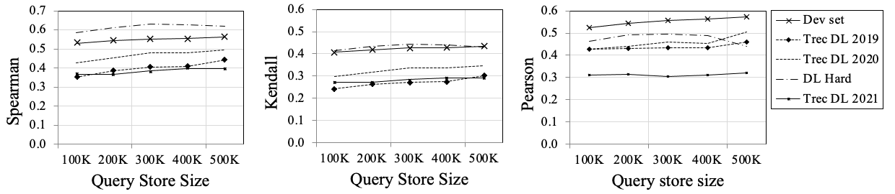

# NN-QPP: Estimating Query Performance Through Rich Contextualized Query Representations

## Introduction
The state-of-the-art query performance prediction methods rely on the fine-tuning of contextual language models to estimate retrieval effectiveness on a per-query basis. Our work in this paper builds on this strong foundation and proposes to learn rich query representations by learning the interactions between the query and two important contextual information, namely the set of documents retrieved by that query, and the set of similar historical queries with known retrieval effectiveness. We propose that such contextualized query representations can be more accurate estimators of query performance as they embed the performance of past similar queries and the semantics of the documents retrieved by the query. We perform extensive experiments on the MSMARCO collection and its accompanying query sets including MSMARCO Dev set and TREC Deep Learning tracks of 2019, 2020, 2021,
and DL-Hard. Our experiments reveal that our proposed method shows robust and effective performance compared to state-of-the-art baselines.

## Running the code

first, you need to clone the repository:

```
git clone https://github.com/sadjadeb/Nearest-Neighbor-QPP.git
```

Then, you need to create a virtual environment and install the requirements:

```
cd Nearest-Neighbor-QPP/
sudo apt-get install virtualenv
virtualenv venv
source venv/bin/activate
pip install -r requirements.txt
```
Then, you need to download the data:
```
bash download_data.sh
```

### Prepare the data

To create a dictionary which maps each query to its actual performance by BM25 (i.e. MRR@10), you need to run the following command:

```
python extract_metrics_per_query.py --run /path/to/run/file --qrels /path/to/qrels/file --qrels /path/to/qrels/file
```

It will create a file named `run-file-name_evaluation-per-query.json` in the `data/eval_per_query` directory.

Then you need to create a file which contains the most similar query from train-set(a.k.a. historical queries with known retrieval effectiveness) to each query. To do so, you need to run the following command:
```
python find_most_similar_query.py --base_queries /path/to/train-set/queries --base_queries /path/to/train-set/queries --base_queries /path/to/train-set/queries --target_queries /path/to/desired/queries --target_queries /path/to/desired/queries --target_queries /path/to/desired/queries --model_name /name/of/the/model --model_name /name/of/the/model --model_name /name/of/the/language/model --hits /number/of/hits --hits /number/of/hits --hits /number/of/hits
```

Finally, to gather all data in a file to make it easier to load the data, you need to run the following commands:

```
python create_train_pkl_file.py
python create_test_pkl_file.py
```

### Training

To train the model, you need to run the following command:

```
python train.py
```

You can change the hyperparameters of the model by changing the values in the lines 9-12 of the `train.py` file.

### Testing

To test the model, you need to run the following command:

```
python test.py
```

### Evaluation

To evaluate the model, you need to run the following command:

```
python evaluation.py --actual /path/to/actual/performance/file --predicted /path/to/predicted/performance/file --target_metric /target/metric
```

## Results

The below table shows the results of our proposed method (NN-QPP) compared to the baselines over four datasets.

<table>
<thead>
  <tr>
    <th rowspan="2">QPP Method</th>
    <th colspan="3">MS MARCO Dev small (6980 queries)</th>
    <th colspan="3">DL Hard (50 Queries)</th>
    <th colspan="3">TREC DL 2019 (43 Queries)</th>
    <th colspan="3">TREC DL 2020 (54 Queries)</th>
    <th colspan="3">TREC DL 2021 (53 Queries)</th>
  </tr>
  <tr>
    <th>Pearson rho</th>
    <th>kendall tau</th>
    <th>Spearman rho</th>
    <th>Pearson Rho</th>
    <th>kendall Tau</th>
    <th>Spearman rho</th>
    <th>Pearson Rho</th>
    <th>kendall Tau</th>
    <th>Spearman rho</th>
    <th>Pearson Rho</th>
    <th>kendall Tau</th>
    <th>Spearman rho</th>
    <th>Pearson Rho</th>
    <th>kendall Tau</th>
    <th>Spearman rho</th>
  </tr>
</thead>
<tbody>
  <tr>
    <td>Clarity</td>
    <td>0.149</td>
    <td>0.258</td>
    <td>0.345</td>
    <td>0.149</td>
    <td>0.099</td>
    <td>0.126</td>
    <td>0.271</td>
    <td>0.229</td>
    <td>0.332</td>
    <td>0.360</td>
    <td>0.215</td>
    <td>0.296</td>
    <td>0.111</td>
    <td>0.070</td>
    <td>0.094</td>
  </tr>
  <tr>
    <td>WIG</td>
    <td>0.154</td>
    <td>0.170</td>
    <td>0.227</td>
    <td>0.331</td>
    <td>0.260</td>
    <td>0.348</td>
    <td>0.310</td>
    <td>0.158</td>
    <td>0.226</td>
    <td>0.204</td>
    <td>0.117</td>
    <td>0.166</td>
    <td>0.197</td>
    <td>0.195</td>
    <td>0.270</td>
  </tr>
  <tr>
    <td>QF</td>
    <td>0.170</td>
    <td>0.210</td>
    <td>0.264</td>
    <td>0.210</td>
    <td>0.164</td>
    <td>0.217</td>
    <td>0.295</td>
    <td>0.240</td>
    <td>0.340</td>
    <td>0.358</td>
    <td>0.266</td>
    <td>0.366</td>
    <td>0.132</td>
    <td>0.101</td>
    <td>0.142</td>
  </tr>
  <tr>
    <td>NeuralQPP</td>
    <td>0.193</td>
    <td>0.171</td>
    <td>0.227</td>
    <td>0.173</td>
    <td>0.111</td>
    <td>0.134</td>
    <td>0.289</td>
    <td>0.159</td>
    <td>0.224</td>
    <td>0.248</td>
    <td>0.129</td>
    <td>0.179</td>
    <td>0.134</td>
    <td>0.221</td>
    <td>0.188</td>
  </tr>
  <tr>
    <td>n($\sigma_\%$)</td>
    <td>0.221</td>
    <td>0.217</td>
    <td>0.284</td>
    <td>0.195</td>
    <td>0.120</td>
    <td>0.147</td>
    <td>0.371</td>
    <td>0.256</td>
    <td>0.377</td>
    <td>0.480</td>
    <td>0.329</td>
    <td>0.478</td>
    <td>0.269</td>
    <td>0.169</td>
    <td>0.256</td>
  </tr>
  <tr>
    <td>RSD</td>
    <td>0.310</td>
    <td>0.337</td>
    <td>0.447</td>
    <td>0.362</td>
    <td>0.322</td>
    <td>0.469</td>
    <td>0.460</td>
    <td>0.262</td>
    <td>0.394</td>
    <td>0.426</td>
    <td>0.364</td>
    <td>0.508</td>
    <td>0.256</td>
    <td>0.224</td>
    <td>0.340</td>
  </tr>
  <tr>
    <td>SMV</td>
    <td>0.311</td>
    <td>0.271</td>
    <td>0.357</td>
    <td>0.375</td>
    <td>0.269</td>
    <td>0.408</td>
    <td>0.495</td>
    <td>0.289</td>
    <td>0.440</td>
    <td>0.450</td>
    <td><strong>0.391</strong></td>
    <td><strong>0.539</strong></td>
    <td>0.252</td>
    <td>0.192</td>
    <td>0.278</td>
  </tr>
  <tr>
    <td>NQC</td>
    <td>0.315</td>
    <td>0.272</td>
    <td>0.358</td>
    <td>0.384</td>
    <td>0.288</td>
    <td>0.417</td>
    <td>0.466</td>
    <td>0.267</td>
    <td>0.399</td>
    <td>0.464</td>
    <td>0.294</td>
    <td>0.423</td>
    <td>0.271</td>
    <td>0.201</td>
    <td>0.292</td>
  </tr>
  <tr>
    <td>UEF_{NQC}</td>
    <td>0.316</td>
    <td>0.303</td>
    <td>0.398</td>
    <td>0.359</td>
    <td>0.319</td>
    <td>0.463</td>
    <td>0.507</td>
    <td>0.293</td>
    <td>0.432</td>
    <td>0.<strong>511</strong></td>
    <td>0.347</td>
    <td>0.476</td>
    <td>0.272</td>
    <td>0.223</td>
    <td>0.327</td>
  </tr>
  <tr>
    <td>NQA-QPP</td>
    <td>0.451</td>
    <td>0.364</td>
    <td>0.475</td>
    <td>0.386</td>
    <td>0.297</td>
    <td>0.418</td>
    <td>0.348</td>
    <td>0.164</td>
    <td>0.255</td>
    <td>0.507</td>
    <td>0.347</td>
    <td>0.496</td>
    <td>0.258</td>
    <td>0.185</td>
    <td>0.265</td>
  </tr>
  <tr>
    <td>BERT-QPP</td>
    <td>0.517</td>
    <td>0.400</td>
    <td>0.520</td>
    <td>0.404</td>
    <td>0.345</td>
    <td>0.472</td>
    <td>0.491</td>
    <td>0.289</td>
    <td>0.412</td>
    <td>0.467</td>
    <td>0.364</td>
    <td>0.448</td>
    <td>0.262</td>
    <td>0.237</td>
    <td>0.340</td>
  </tr>
  <tr>
    <td>qpp-BERT-PL</td>
    <td>0.520</td>
    <td>0.413</td>
    <td>0.522</td>
    <td>0.330</td>
    <td>0.266</td>
    <td>0.390</td>
    <td>0.432</td>
    <td>0.258</td>
    <td>0.361</td>
    <td>0.427</td>
    <td>0.280</td>
    <td>0.392</td>
    <td>0.247</td>
    <td>0.172</td>
    <td>0.292</td>
  </tr>
  <tr>
    <td>qpp-PRP</td>
    <td>0.302</td>
    <td>0.311</td>
    <td>0.412</td>
    <td>0.090</td>
    <td>0.061</td>
    <td>0.063</td>
    <td>0.321</td>
    <td>0.181</td>
    <td>0.229</td>
    <td>0.189</td>
    <td>0.157</td>
    <td>0.229</td>
    <td>0.027</td>
    <td>0.004</td>
    <td>0.015</td>
  </tr>
  <tr>
    <td>NN-QPP</td>
    <td><strong>0.555</strong></td>
    <td><strong>0.421</strong></td>
    <td><strong>0.544</strong></td>
    <td><strong>0.434</strong></td>
    <td><strong>0.412</strong></td>
    <td><strong>0.508</strong></td>
    <td><strong>0.519</strong></td>
    <td><strong>0.318</strong></td>
    <td><strong>0.459</strong></td>
    <td>0.462</td>
    <td>0.318</td>
    <td>0.448</td>
    <td><strong>0.322</strong></td>
    <td><strong>0.266</strong></td>
    <td><strong>0.359</strong></td>
  </tr>
</tbody>
</table>

### Ablation Study

We also conducted an ablation study to investigate the impact of size of the Query-Store on the performance of the model. The below figure shows the results of the study.



## Citation

If you use this code, please cite our paper:

```
@inproceedings{ebrahimi2024estimating,
    title = {Estimating Query Performance Through Rich Contextualized Query Representations},
    author = {Ebrahimi, Sajad and Khodabakhsh, Maryam and Arabzadeh, Negar and Bagheri, Ebrahim},
    year = {2024},
    month = {03},
    pages = {49-58},
    booktitle={European Conference on Information Retrieval},
    organization={Springer},
    isbn = {978-3-031-56065-1},
    doi = {10.1007/978-3-031-56066-8_6}
}
```

